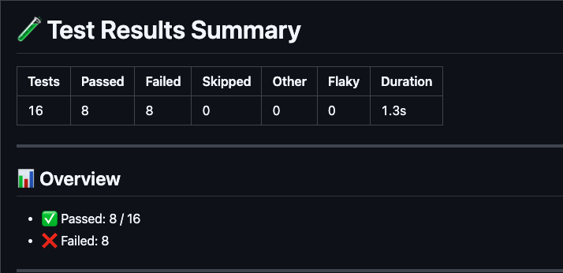

# TestZeus Execute · Composite GitHub Action

Generate detailed CTRF reports from your TestZeus test runs directly from a GitHub Workflow.

---

## 📥 Inputs

| Name | Description | Required |
|------|-------------|----------|
| `test_ids_file` | Path to a JSON file that lists the test IDs to execute and the execution mode. | Yes |
| `email` | TestZeus account email used to authenticate via the CLI. | Yes |
| `password` | TestZeus account password used to authenticate via the CLI. | Yes |

---

## 🗂️ Test IDs JSON Format

Your **`test_ids_file`** *must* follow this shape:

```json
{
  "execution_mode": "lenient",     // or "strict"
  "test_ids": [
    "TC-101",
    "TC-102",
    "TC-103"
  ]
}
```

• **`execution_mode`** — string, either `lenient` or `strict` depending on how you want the tests executed.  
• **`test_ids`** — array of TestZeus test IDs.

> The action validates the file and will fail fast if the structure is invalid.

---

## 🚀 Quick Start

First Add pyproject.toml file using `poetry init --no-interaction` to your repo then replace the python version to ">=3.11,<3.14" using `sed -i "s/>=3.11/>=3.11,<3.14/" pyproject.toml`

```yaml
name: "Run TestZeus Suite"

on: [workflow_dispatch]

jobs:
  testzeus:
    runs-on: ubuntu-latest

    steps:
      - uses: actions/checkout@v4

      - name: Set up Python
        uses: actions/setup-python@v5
        with:
          python-version: "3.11"

      - name: Run image
        uses: abatilo/actions-poetry@v3

      - name: Install dependencies
        run: |
          poetry install --no-root

      - name: Execute TestZeus Tests
        uses: test-zeus-ai/testzeus-execute@v1
        with:
          test_ids_file: "test_ids.json"
          email: ${{ secrets.TESTZEUS_EMAIL }}
          password: ${{ secrets.TESTZEUS_PASSWORD }}

      # Publish a beautiful GitHub summary using CTRF-io
      - name: Publish Test Report
        uses: ctrf-io/github-test-reporter@v1
        with:
          report-path: "ctrf_report.json"
          template-path: "templates/testzeus-report.hbs"
          custom-report: true
          artifact-name: 'ctrf_report'
          upload-artifact: true
        if: always()
```

---

## 📝 Handlebars Template (`templates/testzeus-report.hbs`)

Copy the template below into your repo (for example inside `templates/testzeus-report.hbs`) **or** create your own custom template.  
Then reference the file in your workflow step with the `template-path` input (see the *Publish Test Report* example above).

To create you own custom template then refer the following repos:
- [build custom CTRF template using ctrf-io repo](https://github.com/ctrf-io/github-test-reporter/tree/v1/)
- [Learn how to write handlebar for github actions](https://handlebarsjs.com/guide/)



```hbs
# 🧪 Test Results Summary

| **Tests** | **Passed** | **Failed** | **Skipped** | **Other** | **Flaky** | **Duration** |
|----------|------------|------------|-------------|-----------|-----------|--------------|
| {{ctrf.summary.tests}} | {{ctrf.summary.passed}} | {{ctrf.summary.failed}} | {{add ctrf.summary.skipped ctrf.summary.pending}} | {{ctrf.summary.other}} | {{countFlaky ctrf.tests}} | {{formatDuration ctrf.summary.start ctrf.summary.stop}} |

---

## 📊 Overview
- ✅ Passed: {{ctrf.summary.passed}} / {{ctrf.summary.tests}}
- ❌ Failed: {{ctrf.summary.failed}}

---

## ⚙️ Execution Details
{{#if ctrf.tool.name}} **Tool**: {{ctrf.tool.name}}{{/if}}  
🔍 **Branch**: `{{github.branchName}}`  
👤 **Triggered by**: `{{github.actor}}`

---

{{#if ctrf.summary.failed}}
## ❌ Failed Tests

{{#each ctrf.tests}}
  {{#if (eq this.status "fail")}}
  ### 🔴 {{this.extra.feature_name}} - {{this.extra.scenario_name}}
  - ⏱️ Duration: {{formatDurationMs this.duration}}
  - 🔗 TestZeus Run: [View](https://prod.testzeus.app/test-runs/{{this.extra.test_run_id}})
  {{#if this.extra.test_data_id}}
  - 🧾 Test Data: [View](https://prod.testzeus.app/test-data/{{this.extra.test_data_id.[0]}})
  {{/if}}

  {{#if (getCollapseLargeReports)}}
  <details>
    <summary><strong>View Steps</strong></summary>

    {{#each this.steps}}
    - {{#if (eq this.status "fail")}}❌{{else if (eq this.status "pass")}}✅{{/if}} {{this.name}}
    {{/each}}

  </details>
  {{else}}
  - **Steps**:
    {{#each this.steps}}
    - {{#if (eq this.status "fail")}}❌{{else if (eq this.status "pass")}}✅{{/if}} {{this.name}}
  {{/each}}
  {{/if}}

  {{/if}}
{{/each}}

{{/if}}
```

---

## 🔔 Slack Notification (Optional)

Add a Slack message once the tests finish:

```yaml
- name: Notify Slack
  uses: slackapi/slack-github-action@v1
  with:
    payload: |
      {
        "text": "🧪 TestZeus run finished – see details: ${{ github.run_url }}"
      }
  env:
    SLACK_BOT_TOKEN: ${{ secrets.SLACK_BOT_TOKEN }}
  if: always()
```

---

## 📦 Upload Artifacts (Optional)

```yaml
- name: Upload CTRF report
  uses: actions/upload-artifact@v4
  with:
    name: ctrf-report
    path: ctrf_report.json
```

---

### CTRF Schema

The generated CTRF report follows the **Common Test Report Format (CTRF) v1.0.0** specification. The schema includes:

- **Report metadata**: Format version, specification version, and tool information
- **Test summary**: Aggregate counts (total, passed, failed, pending, skipped, other) and execution timing
- **Individual test results**: Each test includes:
  - Test identification (name, status, duration, timing)
  - Thread/execution context information
  - File attachments (screenshots, logs, artifacts)
  - Step-by-step execution details with individual step status
  - Extended metadata (tenant IDs, test run identifiers, feature/scenario names)

This standardized format ensures compatibility with CTRF-compliant tools and enables consistent test reporting across different testing frameworks.

#### Schema Example

```json
{
  "reportFormat": "CTRF",
  "specVersion": "1.0.0",
  "results": {
    "tool": {
      "name": "testzeus",
      "version": "1.0.0"
    },
    "summary": {
      "tests": 5,
      "passed": 4,
      "failed": 1,
      "start": 1640995200,
      "stop": 1640995800
    },
    "tests": [
      {
        "name": "Login Test",
        "status": "pass",
        "duration": 2500,
        "steps": [
          {
            "name": "Enter credentials",
            "status": "pass"
          }
        ],
        "attachments": [
          {
            "name": "image.png",
            "contentType": "png",
            "path": "<path/to/image>.png"
          }
        ],
        "extra": {
          "tenantid": "abcd",
          "test_run_id": "abcd",
          "test_run_dash_id": "abcd",
          "agent_config_id": "abcd",
          "feature_name": "Authentication",
          "scenario_name": "Login to google"
        }
      }
    ]
  }
}
```

---

## ℹ️ Tips

* Keep your `test_ids_file` under source control so reviewers can see exactly what is being executed.
* Store credentials (`TESTZEUS_EMAIL`, `TESTZEUS_PASSWORD`) as **encrypted repository secrets**.
* Pair this action with schedule triggers to run nightly regression suites.
* The action installs dependencies with **Poetry** and invokes the CLI with `poetry run`.  
  If you use a **self-hosted runner**, make sure Poetry is available on the machine (GitHub-hosted runners already include it).

Happy testing! 🚀 